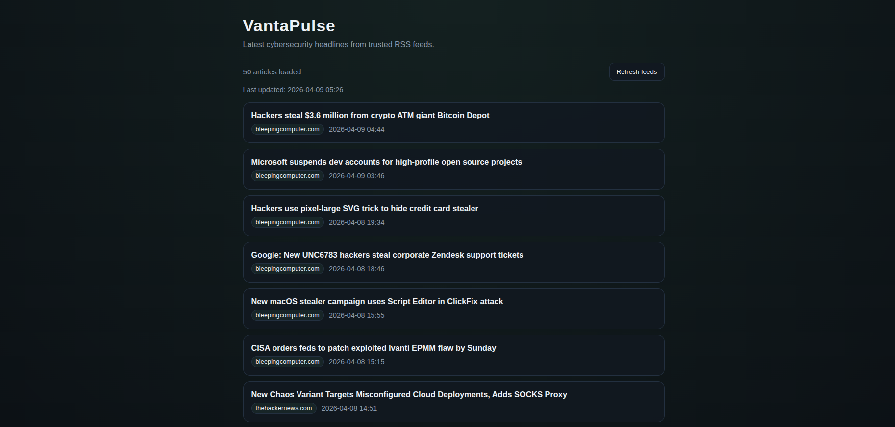

# VantaPulse

Minimal cybersecurity news aggregator built with FastAPI.

## Overview

VantaPulse aggregates cybersecurity news from multiple RSS feeds, deduplicates articles, stores them locally in SQLite, and exposes a minimal web interface and API for browsing the latest headlines.

## Screenshot



Place a project screenshot at `assets/screenshot.png` to display it here later.

## Features

- Aggregates multiple RSS feeds
- Deduplicates articles
- Minimal dark UI
- Fast and lightweight
- Manual refresh endpoint
- SQLite local storage

## Sources

- The Hacker News
- BleepingComputer
- Krebs on Security

## Run locally

```bash
python3 -m venv .venv
source .venv/bin/activate
pip install -r requirements.txt
uvicorn main:app --reload
```

Open `http://127.0.0.1:8000`

## Environment variables

- `PORT`: Optional server port. Defaults to `8000`.
- `UPDATE_TOKEN`: Optional token for `GET /api/update`. If set, use `/api/update?token=...`.

## API

- `GET /api/news`: Returns the latest stored articles as JSON.
- `GET /api/update`: Refreshes feeds manually. If `UPDATE_TOKEN` is set, call `/api/update?token=...`.

## Storage

- SQLite database path: `./data/news.db`
- News is refreshed on startup
- Stored rows are capped to keep the database small

## Deployment

Run in production with:

```bash
uvicorn main:app --host 0.0.0.0 --port ${PORT:-8000}
```
